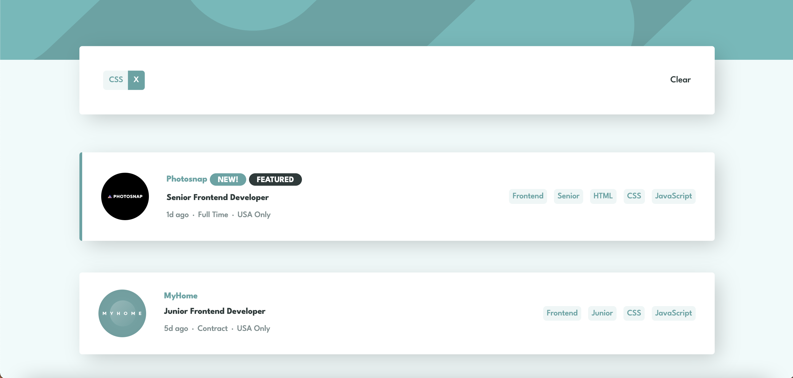

# 🚀Frontend Mentor - Job listings with filtering solution

This is a solution to the [Job listings with filtering challenge on Frontend Mentor](https://www.frontendmentor.io/challenges/job-listings-with-filtering-ivstIPCt).

### 💪🏻 The challenge

Users should be able to:

- View the optimal layout for the site depending on their device's screen size
- See hover states for all interactive elements on the page
- Filter job listings based on the categories

### 🖥 Screenshot

### 🔗 Links

Live Site URL: [Click here](https://carlotablanco.github.io/job-listings-with-filtering)

## My process

### 🛠 Built with

- Semantic HTML5 markup
- SCSS
- Flexbox
- Grid
- Mobile-first workflow
- [React](https://reactjs.org/) - JS library

## 🖌 Author

- Website - [Carlota Blanco](https://carlotablanco.es/)
